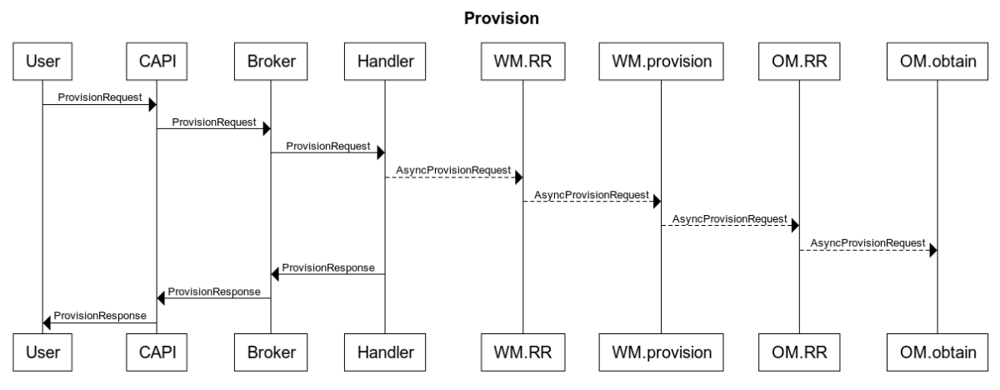
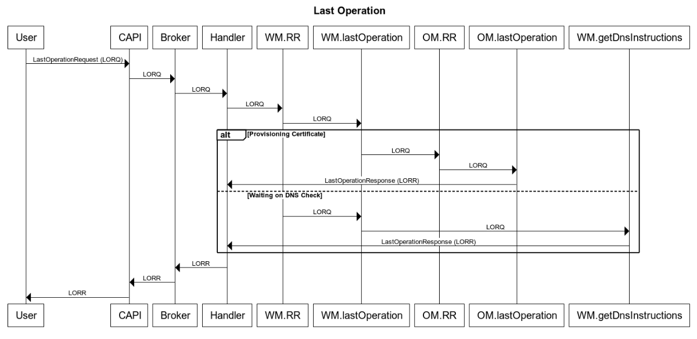

## Managers!

As the broker code has to be more or less completely asynchronous, there are two internal management components which handle varying operations:

* *Worker Manager* (WM)
* *Obtainment Manager* (OM)

Each of these managers has a single point of entry, a single API, if you will: `RequestRouter` (RR). This RR is a channel which accepts an `interface{}`, where you can send requests for the given manager to take action on. Think of it as synonymous to a REST or gRPC API, just an internal one.

### Provisioning Workflow

This workflow happens purely asynchronously. Once the Broker hands the request off to the internal Broker Handler, an asynchronous request is sent to the Worker Manager, where it's handled from there. The Broker Handler responds to CAPI, which surfaces it to the user.

**Legend** 
CAPI: Cloud Foundry API 
WM: Worker Manager 
OM: Obtainment Manager 
RR: Request Router 

### Last Operation Workflow

This workflow happens synchronously.

**Legend** 
CAPI: Cloud Foundry API 
WM: Worker Manager 
OM: Obtainment Manager 
RR: Request Router 

